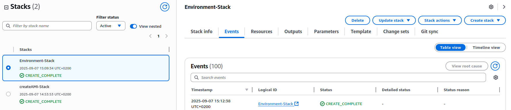
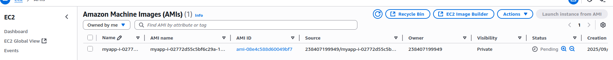
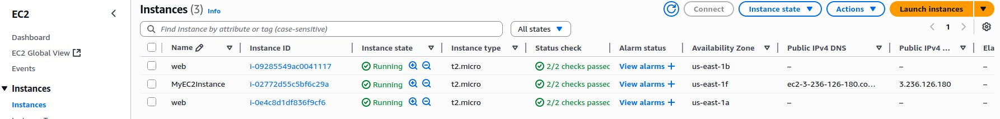
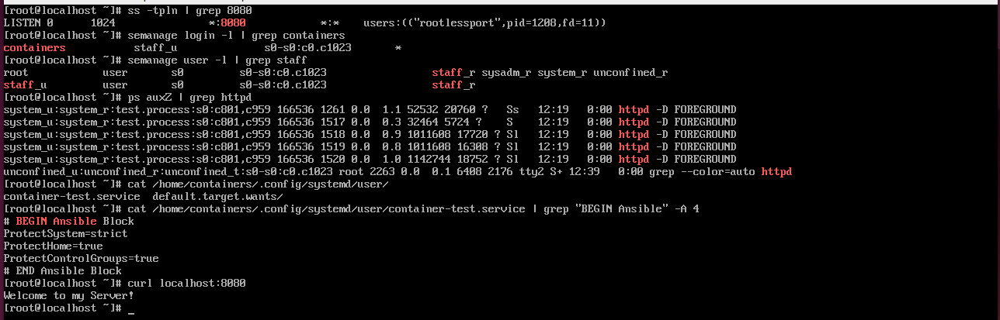
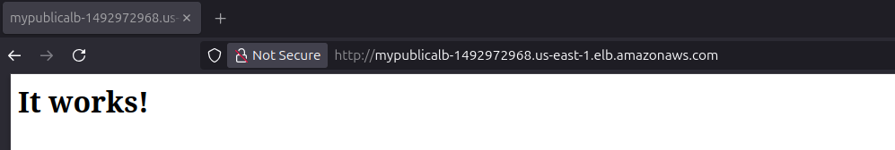

This project is same as project2_ansible.Difference is Im deploying server's on AWS.

Project creates custom user with no shell ( /sbin/nologin ) and no sudo privileges. User is mapped to staff_u SeLinux user which has only one role staff_r ( system_r and other roles are removed ). Using udica I've created custom SeLinux label in which container is running. Container is running in non root enviroment using podman and starts automatically from user systemd file. Systemd file and Sysctl file have custom parametars which make it more secure and isolated.It also has firewall set up and modified SeLinux booleans.

Container is using httpd image with no modifications.

Step 1.
Create AMI image with CloudFormation stack using a file aws-IaC/create_AMI.yaml.
You will be asked for a ssh key and name of AMI.
This will launch EC2 instance,run ansible code on it and create AMI Image.
When you delete a stack AMI Image will stay.Everything else from a stack will be deleted.

Step 2.
Create environment in which server's will be running using aws-IaC/main.yaml.You will be asked for AMI Id.
This will create everything including VPC,Subnets,IG,NAT GW,ALB,AutoScaling..etc.
AutoScaling policy will create two EC2 instances and increase to maximum of five when CPU goes over 70%.

Step 3.
The only way you are going to be able to login into server is through Session Manager (SSHD is disabled).
When you are done just delete stacks and dont forget to delete AMI image.

